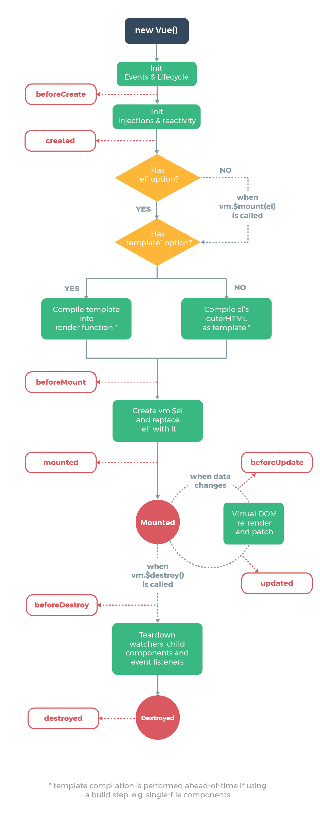

# Creating Vue Instance
Every Vue application starts by creating a new Vue instance with the `Vue` function.

```JavaScript
var vm = new Vue({
  // options
});
// vm stands for ViewModel, as in MVVM pattern
```

When you create a Vue instance, you pass in an options object. A complete list of available options can be found below.

[API - Vue.js](https://vuejs.org/v2/api/#Options-Data)

A Vue application consists of a root Vue instance created with `new Vue`, optionally organized into a tree of nested, reusable components, such as below.

```Bash
Root Instance
└─ TodoList
   ├─ TodoItem
   │  ├─ DeleteTodoButton
   │  └─ EditTodoButton
   └─ TodoListFooter
      ├─ ClearTodosButton
      └─ TodoListStatistics
```

# Data and Methods
When a Vue instance is created, it adds all the properties found in its `data` object to Vue’s reactivity system. When the values of those properties change, the view will "react", updating to match the new values.

```JavaScript
// Our data object
var data = { a: 1 };

// The object is added to a Vue instance
var vm = new Vue({
  data: data
});

// Getting the property on the instance
// returns the one from the original data
vm.a == data.a; // => true

// Setting the property on the instance
// also affects the original data
vm.a = 2;
data.a; // => 2

// ... and vice-versa
data.a = 3;
vm.a; // => 3
```

In addition to data properties, Vue instances expose a number of useful instance properties and methods. These are prefixed with `$` to differentiate them from user-defined properties. For example:

```JavaScript
var data = { a: 1 };
var vm = new Vue({
  el: '#example',
  data: data
});

vm.$data === data; // => true
vm.$el === document.getElementById('example'); // => true

// $watch is an instance method
vm.$watch('a', function (newValue, oldValue) {
  // This callback will be called when `vm.a` changes
});
```

# Instance Lifecycle Hooks
Each Vue instance goes through a series of initialization steps when it’s created - for example, it needs to set up data observation, compile the template, mount the instance to the DOM, and update the DOM when data changes. Along the way, it also runs functions called lifecycle hooks, giving users the opportunity to add their own code at specific stages.

For example, the `created` hook can be used to run code after an instance is created:

```JavaScript
new Vue({
  data: {
    a: 1
  },
  created: function () {
    // `this` points to the vm instance
    console.log('a is: ' + this.a);
  }
});
// => "a is: 1"
```

There are also other hooks which will be called at different stages of the instance’s lifecycle, such as `mounted`, `updated`, and `destroyed`. All lifecycle hooks are called with their `this` (therefore we cannot use arrow function) context pointing to the Vue instance invoking it.

Below is a diagram for the instance lifecycle.

