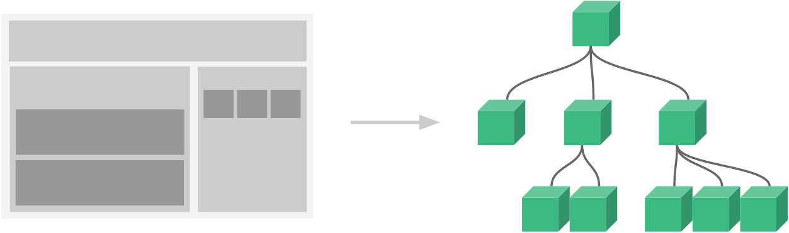

Vue.js (commonly referred to as Vue; pronounced /vjuː/, like "view") is an open-source Model–view–viewmodel JavaScript framework for building user interfaces and single-page applications.

[Vue.js](https://en.wikipedia.org/wiki/Vue.js)

[Introduction - Vue.js](https://vuejs.org/v2/guide/index.html)

# Installing Vue
Installation of Vue can be done through several ways. But the easiest is either by using `npm`:

```Bash
npm  install vue --save
```

or content delivery network (CDN):

```HTML
<!-- For the latest version -->
<script src="https://cdn.jsdelivr.net/npm/vue/dist/vue.js"></script>
<!-- For specific version -->
<script src="https://cdn.jsdelivr.net/npm/vue@2.6.11"></script>
```

[Installation - Vue.js](https://vuejs.org/v2/guide/installation.html)

# Hello Vue
```BASH
Folder Structure
.
├── cs
│   └── style.css
├── index.html
├── js
│   └── script.js
├── node_modules
├── package.json
└── package-lock.json
```

```HTML
<!-- index.html -->
<!DOCTYPE html>
    
<html lang="en">
    
<head>
  <meta charset="utf-8" />
  <meta name="viewport" content="width=device-width, initial-scale=1" />
  <title>Hello Vue</title>
</head>

<body>
  <div id="app">
    {{ message }}
  </div>
  <script src="./node_modules/vue/dist/vue.js"></script>
  <script src="./js/script.js"></script>
</body>

</html>
```

`{{}}` is an interpolation, also known as "Mustache" syntax, which will interacts with Vue.

```JavaScript
// script.js
var vm = new Vue({
  el: '#app',
  data: {
    message: 'Hello Vue!'
  }
});
```

In the code snippet above, we are calling Vue instance, which takes the id of the DOM element i.e. `el:'#app'`, it is the id of the `div`. There is data with the message which is assigned the value `'Hello Vue!'`. Vue interacts with DOM and changes the value in the DOM `{{ message }}` with `'Hello Vue!'`.

## Reactive Vue
The data and the DOM are now linked, and everything is now reactive. Try opening web console, then change the value of `vm.message` to another value.

# Element Attributes Binding
```HTML
<!-- index.html -->
<!DOCTYPE html>

<html lang="en">

<head>
  <meta charset="utf-8" />
  <meta name="viewport" content="width=device-width, initial-scale=1" />
  <title>Hello Vue</title>
</head>

<body>
  <div id="app">
    <span v-bind:title="message">
      Hover your mouse over me for a few seconds
      to see my dynamically bound title!
    </span>
  </div>
  <script src="./node_modules/vue/dist/vue.js"></script>
  <script src="./js/script.js"></script>
</body>

</html>
```

```JavaScript
// script.js
var vm = new Vue({
  el: '#app',
  data: {
    message: 'This is generated by Vue!'
  }
});
```

The `v-bind` attribute is called a directive. Directives are prefixed with `v-` to indicate that they are special attributes provided by Vue, they apply special reactive behavior to the rendered DOM. Here, it is basically saying "keep this element’s title attribute up-to-date with the message property on the Vue instance."

List of HTML element attributes can be found below.

[HTML Attributes](https://www.w3schools.com/tags/ref_attributes.asp)

# Introduction to Conditional Rendering
Vue can do conditional rendering. Therefore Vue can also alter the structure of the DOM. Some of the directives for conditional rendering are `v-if`, `v-else`, `v-else-if`, `v-show`, and `v-for`.

## `v-if`
```HTML
<!-- index.html -->
<!DOCTYPE html>

<html lang="en">

<head>
  <meta charset="utf-8" />
  <meta name="viewport" content="width=device-width, initial-scale=1" />
  <title>Hello Vue</title>
</head>

<body>
  <div id="app">
    <span v-if="seen">Now you see me</span>
  </div>

  <!-- div above can also be written as below -->
  <!-- <div id="app" v-if="seen">Now you see me</div> -->

  <script src="./node_modules/vue/dist/vue.js"></script>
  <script src="./js/script.js"></script>
</body>

</html>
```

```JavaScript
// script.js
var vm = new Vue({
  el: '#app',
  data: {
    seen: true
  }
});
```

Try opening web console, then change the value of `vm.seen` to another `false`.

## `v-for`
```HTML
<!-- index.html -->
<!DOCTYPE html>

<html lang="en">

<head>
  <meta charset="utf-8" />
  <meta name="viewport" content="width=device-width, initial-scale=1" />
  <title>Hello Vue</title>
</head>

<body>
  <div id="app">
    <ol>
      <li v-for="todo in todos">
        {{ todo.text }}
      </li>
    </ol>
  </div>
  <script src="./node_modules/vue/dist/vue.js"></script>
  <script src="./js/script.js"></script>
</body>

</html>
```

```JavaScript
// script.js
var vm = new Vue({
  el: '#app',
  data: {
    todos: [
      { text: 'Learn JavaScript' },
      { text: 'Learn Vue' },
      { text: 'Build something awesome' }
    ]
  }
});
```

Try opening web console, then type `vm.todos.push({ text: 'New item' })`.

## More Reference on Conditional Rendering
There are other directives to perform conditional rendering. Conditional rendering will be discussed thoroughly later, or if you are impatient, you can check the link below.

[Conditional Rendering - Vue.js](https://vuejs.org/v2/guide/conditional.html)

# Handling User Input
To let users interact with your app, we can use the `v-on` directive to attach event listeners that invoke methods on our Vue instances.

```HTML
<!-- index.html -->
<!DOCTYPE html>

<html lang="en">

<head>
  <meta charset="utf-8" />
  <meta name="viewport" content="width=device-width, initial-scale=1" />
  <title>Hello Vue</title>
</head>

<body>
  <div id="app">
    <p>{{ message }}</p>
    <button v-on:click="reverseMessage">Reverse Message</button>
  </div>

  <script src="./node_modules/vue/dist/vue.js"></script>
  <script src="./js/script.js"></script>
</body>

</html>
```

```JavaScript
// script.js
var app = new Vue({
  el: '#app',
  data: {
    message: 'Hello Vue.js!'
  },
  methods: {
    reverseMessage: function () {
      this.message = this.message.split('').reverse().join('')
    }
  }
});
```

## `v-model`
Vue also provides the `v-model` directive that makes two-way binding between form input and app state a breeze.

```HTML
<!-- index.html -->
<!DOCTYPE html>

<html lang="en">

<head>
  <meta charset="utf-8" />
  <meta name="viewport" content="width=device-width, initial-scale=1" />
  <title>Hello Vue</title>
</head>

<body>
  <div id="app">
    <p>{{ message }}</p>
    <input v-model="message">
  </div>

  <script src="./node_modules/vue/dist/vue.js"></script>
  <script src="./js/script.js"></script>
</body>

</html>
```

```JavaScript
// script.js
var app = new Vue({
  el: '#app',
  data: {
    message: 'Hello Vue!'
  }
});
```

# Composing with Components
The component system is another important concept in Vue, because it’s an abstraction that allows us to build large-scale applications composed of small, self-contained, and often reusable components. If we think about it, almost any type of application interface can be abstracted into a tree of components.



In Vue, a component is essentially a Vue instance with pre-defined options. Component will be discussed thoroughly later.